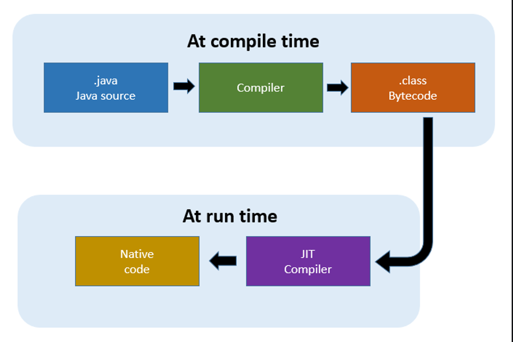

# JVM

## JVM은 무엇인가

자바 가상 머신 java virture machine의 약자로 자바 프로그램이 실행 되는 가상 컴퓨터를 의미 한다. 컴파일 된 바이트코드를 실행하는 역할을 하는데 몇 가지 특징이 있다.

**운영체제에 독립적**

일반적으로 프로그램을 컴파일 하면 컴파일 운영체제와 타겟 운영체제과 다를 경우 프로그램이 정상적으로  동작 하지 않을 수 있다, 다른 운영체제에서도 프로그램을 실행하기 위해서는 크로스컴파일 등의 수정 작업이 필요한데, 자바로 작성한 프로그램은 수정 작업을 거치지 않고도 여러 운영체제에서 실행이 가능 하다. 

 일반 애플리케이션은 운영체제 위에서 실행이 되는데 java 프로그램은 JVM위에서 실행 되고 JVM은 운영체제 위에서 실행된다,따라서 타겟 운영체제에 해당하는 JVM만 설치해 준다면 java 프로그램은 운영체제와 독립적으로 실행가능 하다. 이런 원리로 java 프로그램은 모든 운영체제에서 실행이 가능하다. 

(정확히는 JVM이 동작할 수 있는 모든 운영체제에서...)

**자동으로 메모리 관리**

c 나 c++에 경우 운영체제의 메모리에 직접 접근하기 때문에 free()를 선언해서 할당 받았던 메모리를 해제해 주어야한다. 그렇지 않을 시 메모리 누수(memory leak)가 발생하게 되고 그로인해 현재 프로그램뿐 아니라 다른 프로그램에도  문제가 생길 수 있다. 

java의 경우 JVM 가상 머신을 통해서 간접적으로 메모리 영역에 접근하게 되고, c언어에서의 malloc, free()등에 개발자가 메모리 동적할당 하던 작업을 JVM이 스스로 메모리 관리를 하게 되는데, 즉 사용자가 처리 해야 했던 부분을 JVM 가상머신이 자동으로 메모리 관리를 해준다는 것!! 이 기능을 가비지컬렉션(GC)이라고 한다.

**바이트코드 및 컴파일러**

자바 컴파일러는 자바로 작성 한 소스코드를 JVM이 읽을 수 있는 바이트 코드로 변환 시킨다. (컴파일러 형태는 javac이다.)

바이트 코드는 무엇인가? 

사용자가 작성한 고급언어를 가상머신이 읽고 실행하기 위해서는 가상머신이 인식하기 쉬운 코드로 변환하는 과정이 필요한데 이 변환된 코드를 바이트코드라고 한다.

java는 컴파일시 javac 컴파일러로 파일을 변환하여 JVM에 넘겨주는데

``javac filename.java`` -> `filename.class`

위 변환된 .class파일이 바이트코드이다. c언어에 어셈블리어와 비슷까리 한듯?

javac가 번역기의 기능이라면 jvm은 응당 실행 컴파일러가 있어야겠지

**JIT 컴파일러**

바이트코드로 변환하는 javac는 정적 컴파일러였다면, JIT은 런타임중 동작하는 동적 컴파일러이다.

JVM 실행엔진은 원래 인터프리터 방식을 사용했는데 인터프리터 방식은 느리다는 단점이 있다. 그걸 보완 하기 위해 나온 게JIT(Just_In_Time)컴파일러 인데 

실행 시점에 인터프리터 방식(한줄씩 해석 실행) 으로 코드들을 기계어로 변환하면 저장해 뒀다가, 해당 코드들(같은 함수가 여러 번 불리는 등)이 나올 때 변환된 기계어 코드를 재 사용 하여 매번 기계어 코드를 생성하는 것을 방지한다. JIT컴파일러는 바이트코드를 빠른 속도로 기계어로 변환할 수 있고 이런 과정이 코드가 실행되는 과정 중에 실시간으로 작동한다.

전체적인 구조는 다음과 같다.

## JVM 구성요소

- garbage Collection(GC)
    
    자동으로 메모리 관리를 해주는 부분으로 정리되지 않은 메모리, 유효하지 않은 메모리 즉 더 이상 사용하지 않는 오브젝트들을 자동으로 메모리 해제를 시켜 준다. 다만 사람의 판단력을 갖춘것은 아니기에 모든 메모리누수를 완벽하게 잡아 내진 못할 수 도 있다. (어느 정도는 메모리 관리에 신경을 써야 한다..)
    
- Class Loader
    
    컴파일을 통해 .java에서 .class로 변경된 바이트코드를 JVM에 메모리 영역인 Runtime Data Areas로 로딩을 시켜준다.
    
- Execution Engine
    
    실행 엔진으로 클래스 로더가 바이트코드를  runtime data areas로 로딩을 시키고 완료되면 이것을 실행시켜주는 역할을 하는데 두 가지 방식을 사용한다
    
    1. interpreter(인터프리터)
        
        바이트 코드를 한 줄 씩 (명령어 단위)로 읽어서 실행 한다
        
    2. JIT(just_In_Time)
        
        인터프리터에 경우 코드를 한 줄 씩 읽기 때문에 느리다는 단점이 있는데 그것을 보완하기 위해 나온 컴파일러이다.

### Runtime Data areas

프로그램을 수행하기 위해서 운영체제에서 할당 받은 메모리 공간으로  메모리의 용도에 따라 5가지 영역으로 나누어져 있다.

- Method (모든 스레드가 공유하는 공간)
    
    JVM이 시작될 때 생성되는 공간, 바이트 코드가 이영역에 저장된다. 클래스, 변수, static으로 선언한 공유 변수가 저장 된다. 
    
- Heap (모든 스레드가 공유하는 공간)
    
    동적으로 생성 된 객체가 저장되는 곳으로 GC의 대상이 되는 공간
    
- Stack
    
    지역 변수, 메서스의 매개변수, 임시적으로 사용되는 변수, 메서드 정보가 저장되는 영역으로 해당 메서드의 호출이 종료되면 이 안에 선언된 변수들은 사라진다, 금방 사용 되거나 사용이 끝나는 데이터들이 저장되는 영역
    
- PC register
    
    스레드가 시작될 때 생성 되는 공간,현재 수행중인 JVM 주소와 명령어를 저장 한다.
    
- Native Method
    
    자바 외 언어로 작성 된 네이티브 코드를 위한 메모리 영역