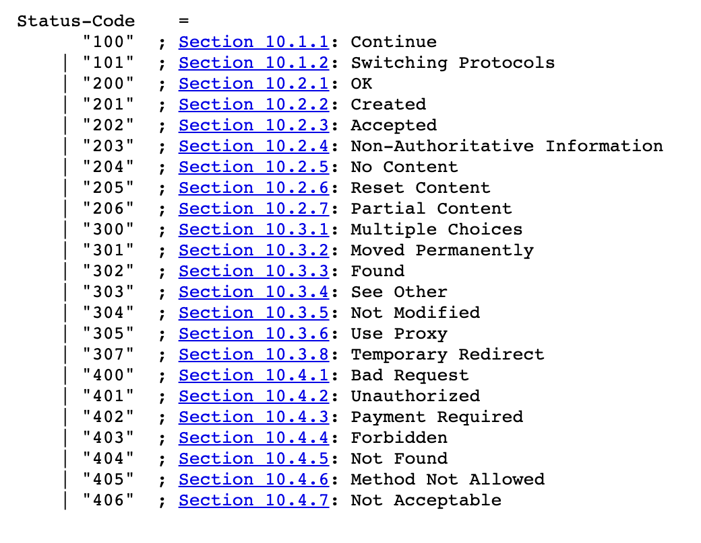
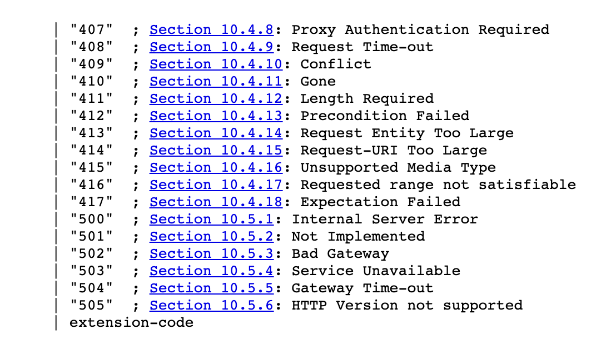

# HTTP

### 개념

HTML 같은 하이퍼미디어 문서를 전송하기 위한 프로토콜로 시작되었다.

웹 서버와 클라이언트간 통신을 위해 설계 되었으며,

그 사이에서 데이터 교환에 사용 되는 문법, 절차 등을 정의한 규약이 http 이다.

TCP/IP 기반으로 되어있으며 request / response 구조로 구성된다.

클라이언트가 서버에 request를 보내면 서버가 response를 보내주는 형식

**Request**

서버가 요청을 처리할 때 참고할 수 있게 클라이언트가 서버에게 전달하는 정보

3가지 부분으로 나누어져 있다

* Start line

	method / target / http version

	위 형식이 기본 구조

	method 는 GET, POST, PUT, DELETE 등이 있다.

	target 는 url 또는 프로토콜. 포트 및 도메인의 절대 경로

	http version 는 말그대로 사용하는 http의 버전을 의미한다

	ex) `GET /62 HTTP/1.1`
* Header

	request에 대한 정보를 담고 있다.

	Accept-Encoding, Accept-Language, Connect, Cookie 등
	많은 옵션이 있고 연결 방식 클라이언트의 정보를 서버에게 알리는 등의 역할을 한다.

* Body

	전송하는 데이터를 담고 있는 부분

	GET, DELETE 요청과 같은 경우 일반적으로 Body가 포함되지 않아 비어있을 수 있다.

**Response**

서버가 클라이언트에게 요청에 해당하는 응답을 보내주는 메시지

3가지 부분으로 나누어져 있다.
* Start line

	http version / status code / status text

	위 형식이 기본 구조이다. 버전과 상태코드 상태 메시지로 구성되어있다.

	ex) `HTTP/1.1 200 ok`

	status code 는  100 ~ 500 번대 까지 있고 번호대 별로 의미가 있다.
	
	100 - 199 : 정보성 상태 코드

	200 - 299 : 성공 상태 코드

	300 - 399 : 리다이렉션 상태 코드

	400 - 499 : 클라이언트 에러 상태 코드

	500 - 599 : 서버 에러 상태 코드

	아래는 http 1.1 기준 상태코드와 해당하는 메세지
	
	
* Header

	reponse에 대한 정보를 담고 있다.

	상태 줄에 배치할 수 없는 추가 적인 정보들을 전달할 수 있다.

	이 헤더 필드는 서버에 대한 정보와 요청 URI로 식별된 리소스에 대한 추가 액세스 정보를 제공해준다.

* Body

	전송하는 데이터를 담고 있는 부분 (html등)

	캐시된 리소스를 요청하는데 리소스가 아직 유효한 경우 등

	필요 없는 경우 비어있다.