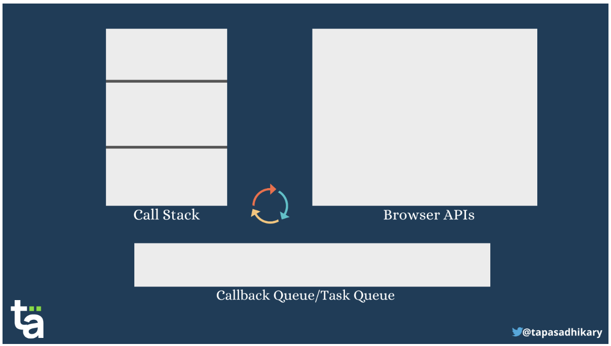

# 면접 질문

## 동기 비동기

**동기식 처리모델**

직렬적으로 일을 처리하는걸 의미한다.

요청이 들어오면 순차적으로 작업을 수행하고 작업이 완료되기 전까지 다른 작업은 대기상태에 놓인다.

한번에 많은 작업이 몰려오면 가장 마지막에 요청을 보낸사람은 대기 시간이 아주 질어지는 문제가 발생할 수 있다.

**비동기 방식**

병렬적으로 일을 수행한다.

새로 요청이 들어왔을 때 현재 작업중이던 요청이 완료되지 않았더라도 계속 요청을 받는다.

작업이 끝났다는 이벤트가 오면 해당 요청을 처리하는 방식

### JS Callback 함수

콜백 함수란 다른 함수의 실행이 완료된 후에  실행되는 함수이다.

만약 콜백 함수를 중첩으로 사용해야 할 경우 코드가 아주 보기 어려워질 것이다. 

```jsx
//2초마다 이름을 출력하는 콜백 함수 중첩
setTimeout(() => {
    console.log("Joel");
    setTimeout(() => {
        console.log("Victoria");
        setTimeout(() => {
            console.log("John");
            setTimeout(() => {
                console.log("Doe");
                setTimeout(() => {
                    console.log("Sarah");
                }, 2000);
            }, 2000);
        }, 2000);
    }, 2000);
}, 2000);
```

위 코드처럼 꼴보기 싫은 복잡한 콜백 중첩 형태를 **콜백 지옥**이라고 한다.

이 경우를 방지 하기 위해 js 에서는 Promise 라는걸 사용한다.

Promise 를 사용하면 비동기를 동기 방식처럼 작성할 수 있다.

- JavaScript 동기식 vs 비동기식
    
    https://www.freecodecamp.org/news/synchronous-vs-asynchronous-in-javascript/
    
    위 링크 서문에서 자바 스크립트를 이렇게 표현한다.
    
    > JavaScript is a **single-threaded**, non-blocking, **asynchronous**, concurrent programming language with lots of flexibility.
    > 
    
    싱글스레드와 비동기란 단어가 같이 나왔다.  공존할 수 있는 단어인가? 계속 한번 따라가보겠다
    
    ---
    
    **동기식 자바스크립트 함수 스택 작동 방식**
    
    js엔진은 실행 중인 현재 함수를 추적하기 위해 함수 실행 스택 이라는 스택 데이터 구조를 유지한다.
    
    함수를 정의한 뒤 호출할 때 흐름
    
    - 호출한 함수를 스택에 추가하고 실행
    - 실행 중인 함수가 다른 함수를 호출하면 두 번째 함수를 스택에 추가하고 실행
    - 두 번째 함수 실행이 완료되면 스택에서 제거
    - 다시 첫번째 함수에서 마지막으로 실행됐던 지점으로 돌아감
    - 첫번째 함수의 실행이 끝나면 스택에서 제거
    - 스택에 넣을 것이 없어질 때까지 반복
    
    함수 실행 스택은 순차적으로 이루어진다.
    
    JavaScript의 main 스레드는 스택을 기반으로 동작 하며 이것은 js 스크립트에 동기적 측면이다
    
    이제 비동기적 측면을 보러가자
    
    ---
    
    **비동기식 자바스크립트 함수 브라우저 API 와 Promise 작동 방식**
    
    일반적으로는 순서대로 실행되는게 좋지만 API를 받아오거나 delay를 주는 등, 
    
    비교적 오래 걸리는 기능을 사용할 때는 다른 순차 스택 들은 마저 실행되는게 효율이 좋다.
    
    js 에서는 두 가지 기본 트리거를 사용해 대부분의 비동기 작업을 분류한다.
    
    - 브라우저 & 웹 API , setTimeout 함수, 마우스 클릭 또는 스크롤 등에 해당하는 이벤트 핸들러
    - Promises: js 에서 비동기 작업을 수행할 수 있게 해주는 고유한 개체
    
    **api 를 처리하는 방법**
    
    setTimeout과 같은 브라우저 API와 이벤트 핸들러들은 콜백 함수에 의존한다.
    
    그리고 콜백 함수는 비동기 작업이 완료된 이후에 실행된다.
    
    ```jsx
    function first() {
    	console.log('first!');
    } 
    
    function second() {
    	console.log('seconde!!');
    }
    
    setTimeout(first, 2000); //2초 뒤 first 함수 실행
    test();                  //test 함수 실행
    ```
    
    위와 같은 코드를 실행 할 때 결과가 어떻게 될까?
    
    test() 함수 호출로 이동하기 위해 2초를 대기 한다면 출력은 다음과 같을 것이다.
    
    1번
    
    > first!
    second!!
    > 
    
    콜백 함수를 제쳐두고 다른 실행을 마저 진행 한다면 출력은 다음과 같을 것이다.
    
    2번
    
    > second!!
    first!
    > 
    
    출력 결과가 1번이라면 비동기 js측면을 공부할 필요도 없다.
    
    당연히 위 코드를 실행해 보면 결과는 2번일 것이다.
    
    어떻게 동작하길래 2번 출력 결과가 나오는지 알아보자
    
    ---
    
    ### JavaScript 콜백 대기열 작동 방식 (Task Queue)
    
    Js 는 Task Queue 라고 불리는 콜백 함수 대기열을 유지한다.
    
    
    
    구조는 위 그림과 같다.
    
    Call Stack은 위에서 보았던 JS 동기적측면인 함수 처리 스택이고
    
    추가된 Browser APIs 와 Task Queue 가 어떤 일을 하는지 알아보자
    
    js 는 TaskQueue 를 조사할 수 있게 **이벤트 루프**를 생성하고
    
    이벤트 루프는 주기적으로 queue를 조사하며 스택이 비어 있을 때 큐에서 stack으로 콜백 함수를 가져온다.  
    
    흐름
    
    - 브라우저 Api가 발생하면 콜백함수를 큐에 보관한다..
    - 스택에서는 평소 처럼 코드 실행이 유지되고 있다.
    - 이벤트 루프가 큐에 콜백함수가 있는지 확인한다.
    - 있다면 큐에 있는 콜백함수를 스택으로 끌고온 후 실행한다.
    - 반복
    
    ```jsx
    function f1() {
    	console.log(1);
    }
    function f2() {
    	console.log(2);
    }
    
    function main() {
    	console.log('main start');
    	setTimeout(f1, 0);     //0 초 대기후 f1 호출
    	f2();
    }
    
    main();
    ```
    
    위에 코드를 실행하면 결과가 어떻게 될까?
    
    setTimeout 에 지연시간을 0초로 설정했기 때문에 f1()이 즉시 실행될 것으로 예상된다.
    
    그럼으로 출력 결과는 아래와 같을 것이다.
    
    - 예상 출력 결과
        
        > main start
        1
        2
        > 
    
    그런데 사실은 그렇지 않다.
    
    - 실제 출력 결과
        
        > main start
        2
        1
        > 
    
    0초 대기면 대기 시간이 없는 건데 왜 f2가 먼저 실행되나?
    
    이유는 위에서 설명한 이벤트 루프 매커니즘에 있다.
    
    - main이 실행되고 setTimeout 으로 인해 f1 함수는 queue로 들어간다.
    - stack은 순차적으로 계속 실행되니 f2가 stack에 들어간다.
    - f2가 실행되고 스택에서 제거되고, main마저 stack에서 제거된다.
    - 이벤트 루프가 콜 스택이 비어있고 큐에 콜백 함수가 존재함을 인식 f2를 스택에 넣어준다.
    - 이제 f2 가 실행되면 스택과 큐 모두 비어있는 상태가 된다.
    
    콜백 함수 처리 로직은 대강 이해가 됐다. 이제 Promise를 보러 가자
    
     
    
    ---
    
    ### JavaScript Promise 처리 방식
    
    Promise 는 생성자를 통해 만들 수 있고 사용할 때 두 개의 함수를 인자로 전달 해야 한다.
    
    resolve와 reject 를 인자로 줘서 성공 또는 실패 일 때 각각 무슨 동작을 할지 미리 정의한다.
    
    Promise 를 실행한 후 .then() 메서드로 결과 처리를, .catch()메서드로 오류 처리를 할 수 있다.
    
    외부 데이터를 받아오기 위해 fetch() 를 사용할 때 약속을 사용한다.
    
    그리고 Promise 는 Job Queue 라는 또 다른 대기열을 사용한다.
    
    Job Queue와 Task Queue 는 비슷한 동작을 하지만 Job Queue가 우선 순위가 더 높다.
    
    흐름
    
    - 이벤트 루프는 반복하면서 콜백 큐에서 하나의 작업을 완료한다.
    - 만약 콜백 큐와 job 큐가 동시에 존재할 경우 이벤트루프는 job 큐에 있는 작업을 먼저 완료한 후,
    콜백 큐로 돌아간다.
    

Promise 는 3가지 상태를 가진다.

- 대기: 성공하거나 실패하기 전 초기상태
- 성공: promise 성공 (resolve 인 경우)
- 실패: promise 실패 (reject 인 경우)

```jsx
//콜백 지옥을 Promise로 재구현
function addName (time, name){
  return new Promise ((resolve, reject) => {
    if(name){
      setTimeout(()=>{
        console.log(name)
        resolve();
      },time)
    }else{
      reject('No such name');
    }
  })
}

addName(2000, 'Joel')
  .then(()=>addName(2000, 'Victoria'))
  .then(()=>addName(2000, 'John'))
  .then(()=>addName(2000, 'Doe'))
  .then(()=>addName(2000, 'Sarah'))
  .catch((err)=>console.log(err))
```

확실히 보기 편해졌다. 

